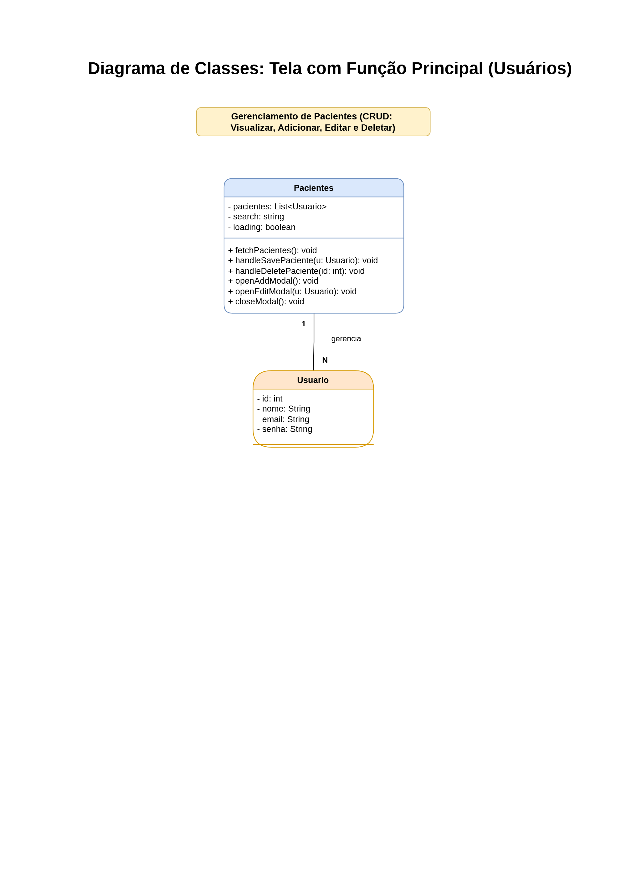

# 📊 Diagrama de Classes

Este documento apresenta o diagrama de classes do sistema de gerenciamento de pacientes, desenvolvido com React e integração com Supabase.

---

## 📌 Descrição do Sistema

O sistema tem como objetivo gerenciar informações de pacientes por meio de operações básicas de CRUD:

- ➕ Criar (adicionar novos pacientes)
- 🔍 Ler (visualizar pacientes cadastrados)
- ✏️ Atualizar (editar informações)
- ❌ Deletar (remover pacientes)

---

## 🧠 Estrutura e Modelagem

A aplicação segue uma abordagem simplificada de Programação Orientada a Objetos, organizada da seguinte forma:

- **Componente Pacientes (React)**  
  Responsável pela interface do usuário e controle das operações.

- **Entidade Paciente (Usuário)**  
  Representa os dados armazenados no sistema.

A lógica da aplicação está concentrada no componente principal, utilizando o Supabase como serviço externo para persistência de dados.

---

## 📊 Diagrama de Classes

Abaixo está a representação visual da estrutura do sistema:

---

## 📁 Arquivos Relacionados

- 📄 Diagrama completo: `DiagramaPacientes.drawio.pdf`

---

## 📝 Observação

Este material foi desenvolvido como parte da entrega da disciplina, com foco na representação estrutural do sistema e aplicação dos conceitos de orientação a objetos.
